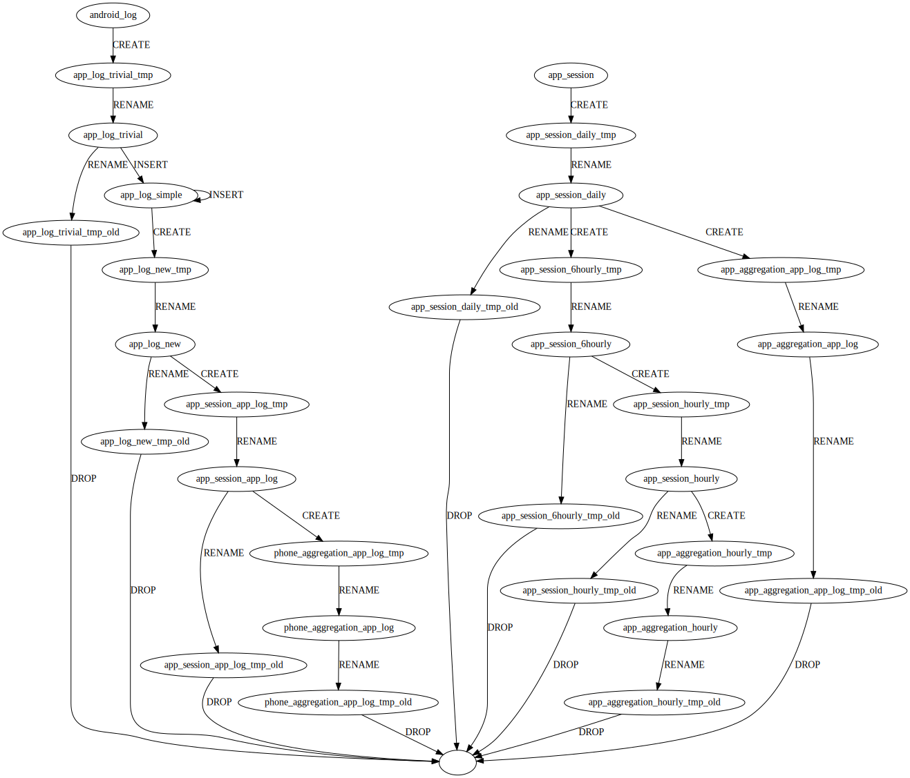

# SQL Lineage with sqlfluff

The repository shows how to use the sqlfluff parser to obtain the table lineage on complex ClickHouse queries.

The main idea is to use [sqlfluff](https://github.com/sqlfluff/sqlfluff) as the parser, and then extract the Abstract Syntax Tree into the convenient [anytree format](https://github.com/c0fec0de/anytree).
See the notebook for the details.

The final result, obtained on a large ClickHouse query, looks as below:

